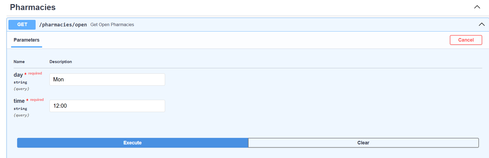
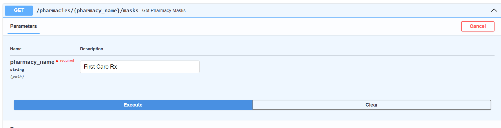
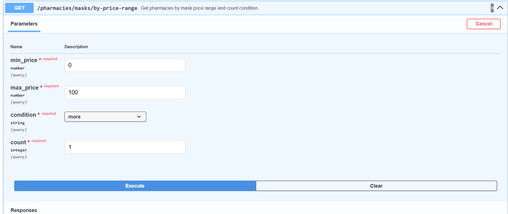
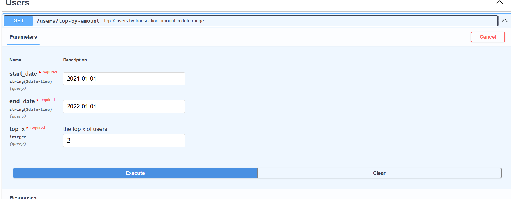
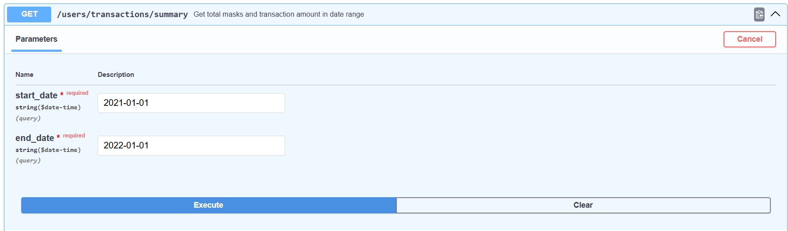
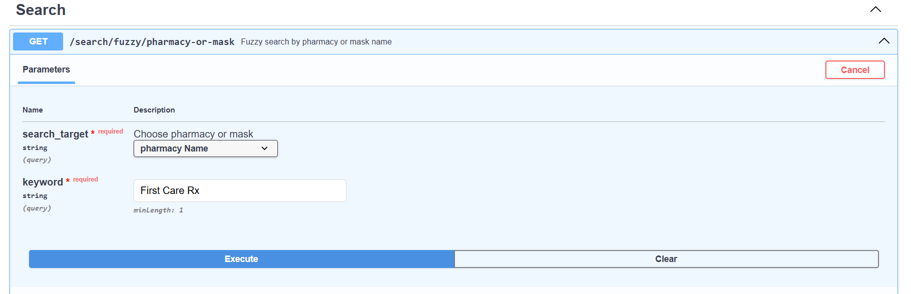
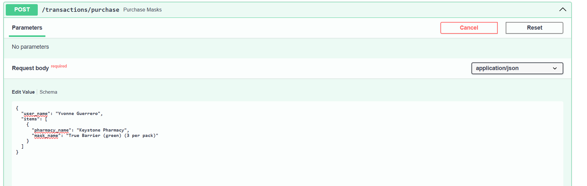
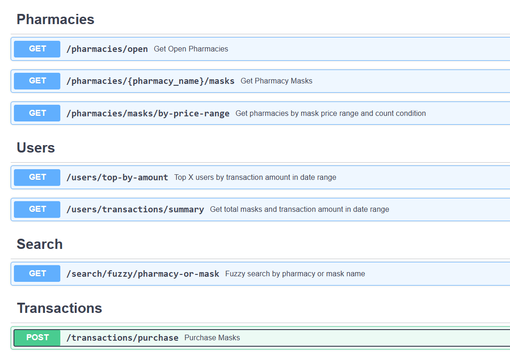
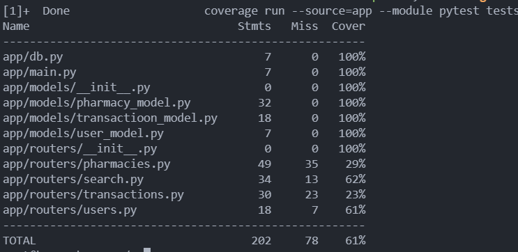

# Response
## A. Required Information
### A.1. Requirement Completion Rate
- [V] List all pharmacies open at a specific time and on a day of the week if requested.
  - Implemented endpoint `/pharmacies/open`.
  - Example input
  
- [V] List all masks sold by a given pharmacy, sorted by mask name or price.
  - Implemented at endpoint `/pharmacies/{pharmacy_name}/masks`.
  - Example input
  
- [V] List all pharmacies with more or less than x mask products within a price range.
  - Implemented at endpoint `/pharmacies/masks/by-price-range`.
  - Example input
  
- [V] The top x users by total transaction amount of masks within a date range.
  - Implemented at endpoint `/users/top-by-amount`.
  - Example input
  
- [V] The total number of masks and dollar value of transactions within a date range.
  - Implemented at endpoint `/users/transactions/summary`.
  - Example input
  
- [V] Search for pharmacies or masks by name, ranked by relevance to the search term.
  - Implemented at endpoint `/search/fuzzy/pharmacy-or-mask`.
  - Example input
  
- [V] Process a user purchases a mask from a pharmacy, and handle all relevant data changes in an atomic transaction.
  - Implemented at endpoint `/transactions/purchase`.
  - Example input
  

### A.2. API Document
After using `docker-compose.yml`, you should be able to open the following swagger docs
[swagger](http://localhost:9789/docs).


### A.3. Import Data Commands
Data import is implemented in [start.sh](start.sh), once the API is started, data will be imported<br>
Commands for ETL and DB startup are included in [scipts/init_db.py](scripts/init_db.py) and [scripts/convert_to_schema.py](scripts/conver_to_schema.py)

## B. Bonus Information

### B.1. Dockerized
Please check my [Dockerfile](docker/Dockerfile) / [docker-compose.yml](docker/docker-compose.yml).

On the local machine, please follow the commands below to build it.
After building image, you should be able to use docker-compose to have DB and API service
```bash
$ docker build -t fastapi:test -f docker/Dockerfile .  
$ docker-compose up -d
```
### B.2 Deployment (Verbal Summary)
Due to limited time, I haven’t completed the implementation yet, but I’d like to explain my idea verbally. I’ve previously tried two approaches:
1. **Azure Web Service + Azure DevOps Repo**  
  I used this method for deployment before, but it doesn’t fit well with the current project structure, since I’m using Docker Compose to run multiple services.
2. **Azure VM + Docker + Azure DevOps Repo**  
  This setup works better for the current architecture. I installed Docker on the VM and used the Azure DevOps Repo to deploy the project. It's more flexible and suitable for running a `docker-compose.yml`-based application.

### B.3. Test
Due to limited time, I've only completed an integration test for my router `search`, but only achieved coverage of 61%.<br> 
Command to reproduce test
```bash
$ docker exec -it api /bin/bash
$ coverage run --source=app --module pytest tests && coverage report
```

